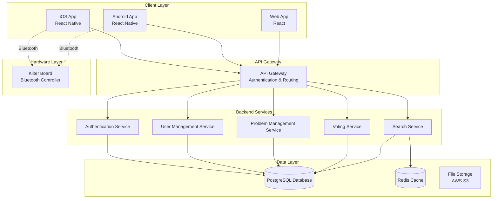

# Kilter Board Application Design Document

## Overview

The Kilter Board Application is a comprehensive cross-platform mobile and web system that enables climbers to interact with Kilter Board climbing training hardware. The system consists of three main components:

1. **Cross-Platform Mobile Applications** (iOS/Android) - Built using React Native for code sharing and native performance
2. **Backend Server Infrastructure** - Node.js/Express API with PostgreSQL database for scalability and reliability
3. **Bluetooth Integration Layer** - Native modules for direct board control and real-time hold illumination

The architecture follows a client-server model with RESTful APIs, real-time WebSocket connections for live updates, and Bluetooth Low Energy (BLE) protocols for hardware communication. The system emphasizes data consistency, offline capability, and seamless synchronization across devices.

## Architecture

### High-Level Architecture



### Technology Stack

**Frontend (Cross-Platform)**
- React Native 0.72+ for mobile applications
- React 18+ for web application
- TypeScript for type safety
- React Navigation for routing
- React Query for state management and caching
- React Native Bluetooth Serial for hardware communication

**Backend**
- Rust with Axum web framework
- SQLx for compile-time verified SQL queries (no ORM)
- sqlx-migrate for database migration management
- PostgreSQL 15+ for primary data storage
- Redis for caching and session management
- Supabase Auth for authentication with social login support
- JSON Web Tokens (JWT) for session management
- RESTful API design for core functionality
- Optional WebSocket support for future real-time features

**Infrastructure**
- Docker containers for deployment
- Google Cloud Platform (GCP) hosting
- Kubernetes for orchestration and scaling
- CI/CD pipeline with automated testing
- Monitoring with application performance management

## Components and Interfaces

### Core Components

#### 1. User Management Component
**Responsibilities:**
- User registration, authentication, and profile management
- Climbing statistics tracking and achievement calculation
- Account data synchronization across devices

**Key Interfaces:**
```typescript
interface UserAccount {
  id: string;
  email: string;
  username: string;
  profile: UserProfile;
  statistics: ClimbingStatistics;
  createdAt: Date;
  updatedAt: Date;
}

interface ClimbingStatistics {
  totalAttempts: number;
  totalAscents: number;
  personalBestGrade: string;
  streakRecords: StreakRecord[];
  milestones: Milestone[];
}
```

#### 2. Boulder Problem Management Component
**Responsibilities:**
- Problem creation, editing, and publishing
- Hold configuration validation and storage
- Tag management and validation
- Problem metadata handling

**Key Interfaces:**
```typescript
interface BoulderProblem {
  id: string;
  name: string;
  creatorId: string;
  holdConfiguration: HoldConfiguration;
  difficulty: string; // V-scale grade
  tags: ProblemTag[];
  createdAt: Date;
  updatedAt: Date;
}

interface HoldConfiguration {
  holds: Hold[];
  boardModel: string;
  version: string;
}

interface ProblemTag {
  id: string;
  name: string; // matches [\w-]+ pattern
  category: TagCategory;
}
```

#### 3. Voting and Rating Component
**Responsibilities:**
- Dual-dimension voting system (stars + difficulty)
- Vote aggregation and consensus calculation
- Rating history and user vote tracking

**Key Interfaces:**
```typescript
interface Vote {
  id: string;
  userId: string;
  problemId: string;
  starRating: number; // 1-4 stars
  difficultyGrade: string; // V-scale
  createdAt: Date;
  updatedAt: Date;
}

interface AggregateRating {
  problemId: string;
  averageStars: number;
  consensusDifficulty: string;
  totalVotes: number;
  starDistribution: number[]; // [1-star count, 2-star count, ...]
  gradeDistribution: Map<string, number>;
}
```

#### 4. Search and Discovery Component
**Responsibilities:**
- Multi-criteria search functionality
- Tag-based filtering with AND logic
- Grade range filtering and sorting
- Search result ranking and relevance

**Key Interfaces:**
```typescript
interface SearchCriteria {
  keyword?: string;
  creatorId?: string;
  minGrade?: string;
  maxGrade?: string;
  tags?: string[];
  sortBy?: 'ascents' | 'stars' | 'created' | 'difficulty';
  sortOrder?: 'asc' | 'desc';
}

interface SearchResult {
  problems: BoulderProblem[];
  totalCount: number;
  facets: SearchFacets;
}
```

#### 5. Bluetooth Communication Component
**Responsibilities:**
- Board discovery and connection management
- Hold illumination control
- Firmware compatibility verification
- Connection state management

**Key Interfaces:**
```typescript
interface BluetoothController {
  connect(boardId: string): Promise<boolean>;
  disconnect(): Promise<void>;
  illuminateHolds(configuration: HoldConfiguration): Promise<boolean>;
  getBoardInfo(): Promise<BoardInfo>;
  isConnected(): boolean;
}

interface BoardInfo {
  model: string;
  firmwareVersion: string;
  serialNumber: string;
  batteryLevel?: number;
}
```

## Data Models

### Database Schema

#### Users Table
```sql
CREATE TABLE users (
  id UUID PRIMARY KEY DEFAULT gen_random_uuid(),
  email VARCHAR(255) UNIQUE NOT NULL,
  username VARCHAR(50) UNIQUE NOT NULL,
  password_hash VARCHAR(255) NOT NULL,
  profile JSONB NOT NULL DEFAULT '{}',
  statistics JSONB NOT NULL DEFAULT '{}',
  created_at TIMESTAMP WITH TIME ZONE DEFAULT NOW(),
  updated_at TIMESTAMP WITH TIME ZONE DEFAULT NOW()
);
```

#### Boulder Problems Table
```sql
CREATE TABLE boulder_problems (
  id UUID PRIMARY KEY DEFAULT gen_random_uuid(),
  name VARCHAR(255) NOT NULL,
  creator_id UUID NOT NULL REFERENCES users(id),
  hold_configuration JSONB NOT NULL,
  difficulty VARCHAR(10) NOT NULL,
  tags TEXT[] DEFAULT '{}',
  ascent_count INTEGER DEFAULT 0,
  created_at TIMESTAMP WITH TIME ZONE DEFAULT NOW(),
  updated_at TIMESTAMP WITH TIME ZONE DEFAULT NOW()
);
```

#### Votes Table
```sql
CREATE TABLE votes (
  id UUID PRIMARY KEY DEFAULT gen_random_uuid(),
  user_id UUID NOT NULL REFERENCES users(id),
  problem_id UUID NOT NULL REFERENCES boulder_problems(id),
  star_rating INTEGER CHECK (star_rating >= 1 AND star_rating <= 4),
  difficulty_grade VARCHAR(10) NOT NULL,
  created_at TIMESTAMP WITH TIME ZONE DEFAULT NOW(),
  updated_at TIMESTAMP WITH TIME ZONE DEFAULT NOW(),
  UNIQUE(user_id, problem_id)
);
```

#### User Attempts Table
```sql
CREATE TABLE user_attempts (
  id UUID PRIMARY KEY DEFAULT gen_random_uuid(),
  user_id UUID NOT NULL REFERENCES users(id),
  problem_id UUID NOT NULL REFERENCES boulder_problems(id),
  outcome VARCHAR(20) NOT NULL CHECK (outcome IN ('attempt', 'ascent')),
  created_at TIMESTAMP WITH TIME ZONE DEFAULT NOW()
);
```

#### Problem Sets Table
```sql
CREATE TABLE problem_sets (
  id UUID PRIMARY KEY DEFAULT gen_random_uuid(),
  name VARCHAR(255) NOT NULL,
  creator_id UUID NOT NULL REFERENCES users(id),
  description TEXT,
  problem_ids UUID[] NOT NULL,
  created_at TIMESTAMP WITH TIME ZONE DEFAULT NOW(),
  updated_at TIMESTAMP WITH TIME ZONE DEFAULT NOW()
);
```

### Data Validation Rules

1. **Problem Tags**: Must match regex pattern `[\w-]+`
2. **Difficulty Grades**: Must follow V-scale format (V0, V1, V2, etc.)
3. **Star Ratings**: Integer values 1-4 inclusive
4. **Hold Configurations**: Must contain valid hold positions for specified board model
5. **User Emails**: Must be valid email format and unique
6. **Usernames**: 3-50 characters, alphanumeric and underscores only
## Correctness Properties

*A property is a characteristic or behavior that should hold true across all valid executions of a system-essentially, a formal statement about what the system should do. Properties serve as the bridge between human-readable specifications and machine-verifiable correctness guarantees.*

### Property Reflection

After analyzing all acceptance criteria, several properties can be consolidated to eliminate redundancy:

- **User Account Properties**: Properties 1.1-1.7 can be grouped into account lifecycle management
- **Problem Management Properties**: Properties 2.1-2.8 focus on problem creation and validation
- **Search Properties**: Properties 3.1-3.7 can be combined into comprehensive search validation
- **Voting Properties**: Properties 4.1-4.7 cover the dual-dimension voting system
- **Serialization Properties**: Properties 2.8, 10.3-10.5 all relate to JSON round-trip consistency

### Core Properties

**Property 1: User Account Lifecycle Consistency**
*For any* valid user registration data, creating an account should initialize all required data structures (statistics, history, voting records) and enable authentication with the provided credentials
**Validates: Requirements 1.1, 1.2, 1.5**

**Property 2: Problem Creation Validation**
*For any* boulder problem creation attempt, the system should require all mandatory fields (name, difficulty, hold configuration) and reject problems missing required data
**Validates: Requirements 2.5**

**Property 3: Tag Validation Consistency**
*For any* problem tag, the system should accept only tags matching the pattern [\w-]+ and reject any tags containing invalid characters
**Validates: Requirements 2.6, 2.7**

**Property 4: JSON Serialization Round-Trip**
*For any* valid Boulder_Problem object, serializing to JSON and then deserializing should produce an identical object
**Validates: Requirements 2.8, 10.3, 10.4, 10.5**

**Property 5: Search Filter Consistency**
*For any* search with grade range filters, all returned problems should have difficulty grades within the specified minimum and maximum bounds
**Validates: Requirements 3.1**

**Property 6: Tag Filter AND Logic**
*For any* search with multiple tag filters, all returned problems should contain every specified tag
**Validates: Requirements 3.4**

**Property 7: Search Result Sorting**
*For any* search results sorted by ascents or star rating, the results should be ordered correctly according to the specified sort criteria
**Validates: Requirements 3.6, 3.7**

**Property 8: Dual-Dimension Vote Recording**
*For any* user vote submission, the system should record both star rating (1-4) and difficulty grade (V-scale) as separate, independent values
**Validates: Requirements 4.2**

**Property 9: Vote Uniqueness Constraint**
*For any* user and problem combination, the system should allow only one vote record, updating existing votes rather than creating duplicates
**Validates: Requirements 4.4**

**Property 10: Rating Aggregation Accuracy**
*For any* problem with votes, the displayed aggregate rating should correctly compute the average star rating and consensus difficulty from all user votes
**Validates: Requirements 4.6**

**Property 11: Cross-Platform Data Synchronization**
*For any* user account, data should remain consistent when accessed from different platforms (iOS, Android, Web)
**Validates: Requirements 6.2**

**Property 12: Bluetooth Hold Illumination**
*For any* selected boulder problem, the Bluetooth controller should illuminate exactly the holds specified in the problem's hold configuration
**Validates: Requirements 8.1**

**Property 13: Attempt Tracking Completeness**
*For any* user interaction with a boulder problem, the system should record the attempt with accurate timestamp and outcome data
**Validates: Requirements 9.1**

**Property 14: Statistics Update Consistency**
*For any* successful ascent, the user's personal statistics should be updated to reflect the new achievement data
**Validates: Requirements 9.2**

**Property 15: Data Persistence Immediacy**
*For any* content creation operation, the data should be immediately available in the storage system after the operation completes
**Validates: Requirements 10.1**

## Error Handling

### Error Categories and Strategies

#### 1. Validation Errors
- **Input Validation**: Reject invalid data with clear error messages
- **Business Rule Violations**: Prevent operations that violate domain constraints
- **Format Errors**: Handle malformed data gracefully with user-friendly feedback

#### 2. Network and Connectivity Errors
- **API Failures**: Implement retry logic with exponential backoff
- **Bluetooth Disconnections**: Provide reconnection options and offline mode
- **Sync Conflicts**: Use conflict resolution strategies for data synchronization

#### 3. Authentication and Authorization Errors
- **Invalid Credentials**: Clear error messages without revealing security details
- **Session Expiry**: Automatic token refresh with fallback to re-authentication
- **Permission Denied**: Informative messages about required permissions

#### 4. Data Integrity Errors
- **Corruption Detection**: Checksums and validation for critical data
- **Recovery Procedures**: Automated recovery with administrator alerts
- **Backup Restoration**: Point-in-time recovery capabilities

### Error Response Format
```typescript
interface ErrorResponse {
  error: {
    code: string;
    message: string;
    details?: any;
    timestamp: string;
    requestId: string;
  };
}
```

## Testing Strategy

### Dual Testing Approach

The testing strategy employs both unit testing and property-based testing to ensure comprehensive coverage:

- **Unit tests** verify specific examples, edge cases, and error conditions
- **Property tests** verify universal properties that should hold across all inputs
- Together they provide comprehensive coverage: unit tests catch concrete bugs, property tests verify general correctness

### Property-Based Testing Framework

**Framework**: fast-check (JavaScript/TypeScript property-based testing library)
**Configuration**: Minimum 100 iterations per property test
**Annotation Format**: Each property-based test must include a comment with the format:
`**Feature: kilter-board-app, Property {number}: {property_text}**`

### Unit Testing Framework

**Framework**: Jest with React Native Testing Library
**Coverage**: Focus on specific examples, integration points, and edge cases
**Co-location**: Tests placed alongside source files using `.test.ts` suffix

### Test Categories

#### 1. Property-Based Tests
- User account lifecycle operations
- Problem creation and validation
- Search and filtering logic
- Vote recording and aggregation
- JSON serialization round-trips
- Cross-platform data consistency

#### 2. Unit Tests
- API endpoint responses
- Component rendering
- Error handling scenarios
- Bluetooth communication protocols
- Database query results

#### 3. Integration Tests
- End-to-end user workflows
- Cross-service communication
- Database transaction integrity
- Real-time synchronization

### Test Data Generation

**Smart Generators**: Property tests use intelligent generators that constrain inputs to valid domains:
- Valid V-scale grades (V0-V17)
- Properly formatted email addresses
- Valid hold configurations for specific board models
- Realistic climbing statistics and achievement data

### Testing Requirements

- All property-based tests must run a minimum of 100 iterations
- Each property test must be tagged with its corresponding design document property
- Tests must validate real functionality without mocks where possible
- Test failures must be investigated and resolved before task completion
- Property tests should focus on core logic across many inputs
- Unit tests should cover specific examples and important edge cases